# Lec1. The Geometry of Linear Equations

MIT 18.06 Gilbert Strange, Linear Algebra, Spring 2005

This doucment is edited by Steve Ive based on Youtube Lecture.

Images are created by Steve Ive.

---

Here, we are going to solve some examples of linear equations, approaching by **three different ways**. 

With these three ways, we'll see how those approach solve the same problem respectively, and finally we would get the insight of how the same problem can be seen and solved differently. The **Column Picture** is one of the important part in this lecture, will show how problem can be approched compared to conventional approach.

---

The fundamental problem of linear algebra which is to solve a system of linear equations.

### n linear equations, n unknowns.

To solve this, there can be three approaches with the same problem.

- Row Picture

- ***Column Picture***

- Matrix Form

---
Let's start with the example.

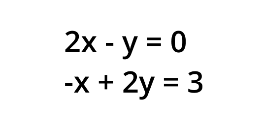

First, what is the Matrix?

Matrix is just a **rectangular array of numbers**

Let's then express above as matrix.

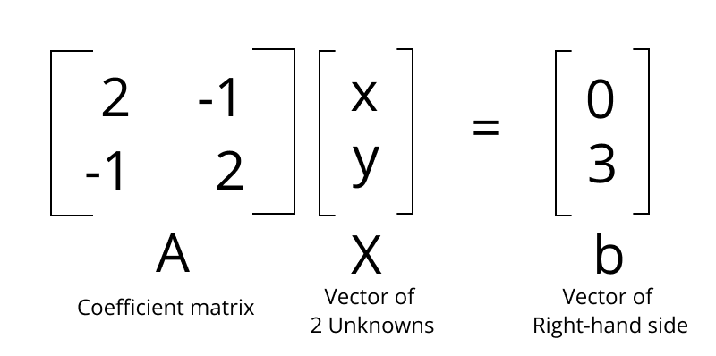

So the linear equations are ***AX = b***

Let's solve this particular example, and then step back to see the bigger picture.

## Row Picture

**The row picture means that take one row at a time.**

We can plot all the points satisfying first equation, and here are two points that satisfy that equation.

> origin (x = 0, y = 0)

> x = 1, y = 2

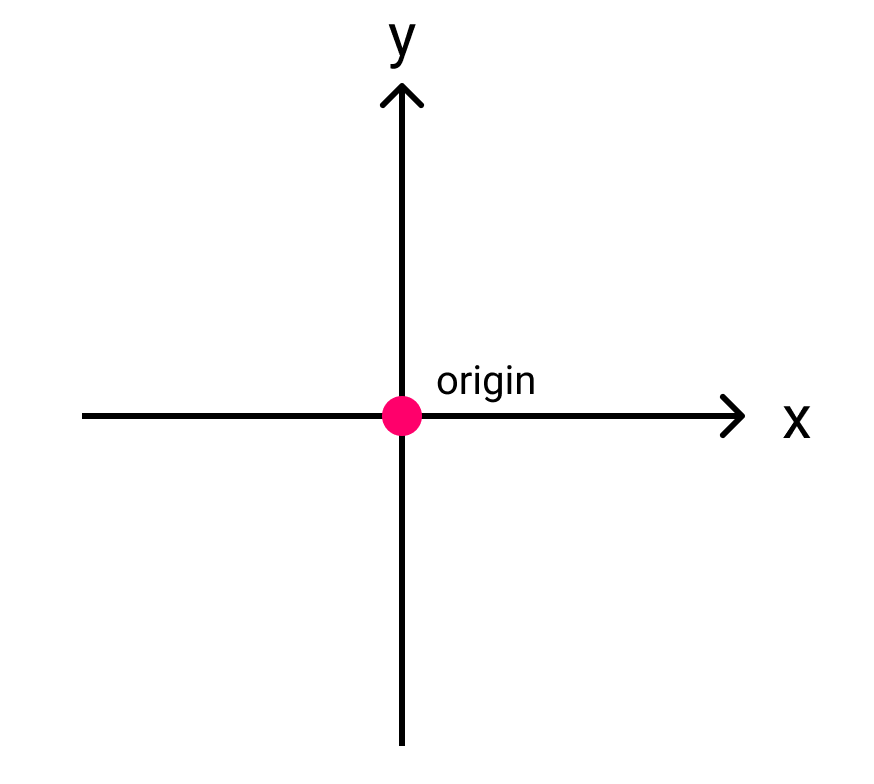

we can put all the points at once because they all lie on a straight line.

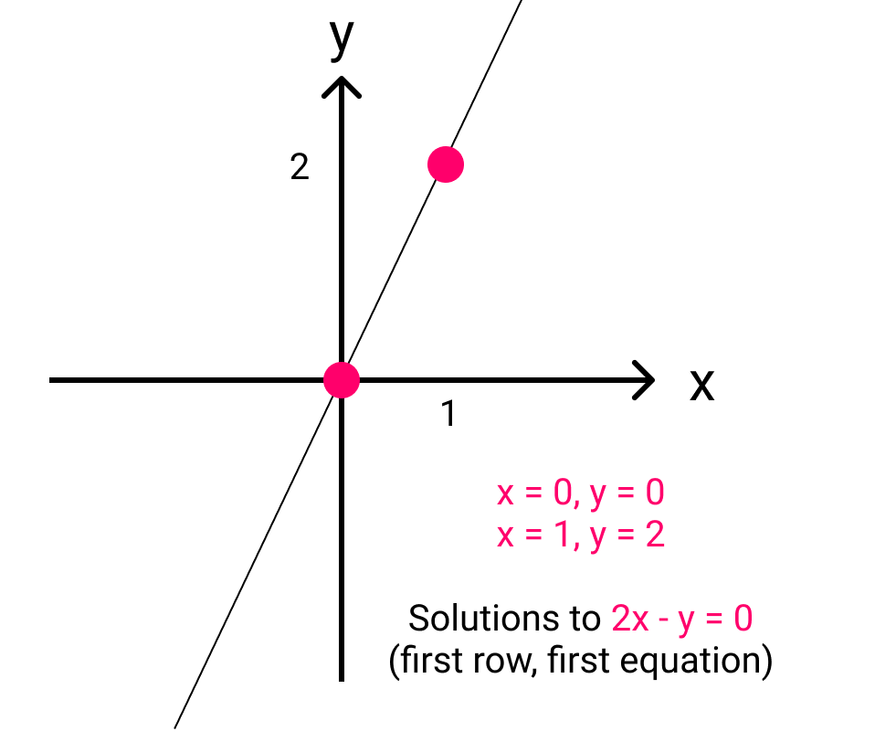

How about the second one? The second one is not going to through the origin. It's always important **Do we go through the origin or not**.

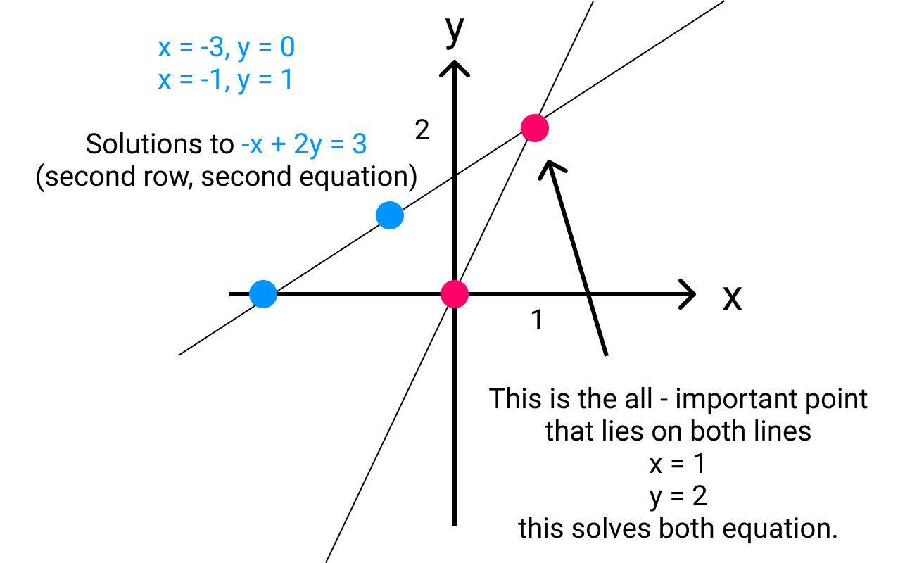

## Column Picture

Now I'm going to look at the columns of the matrix.

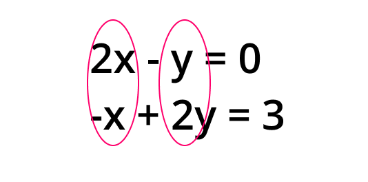

We can put the two equations at once.

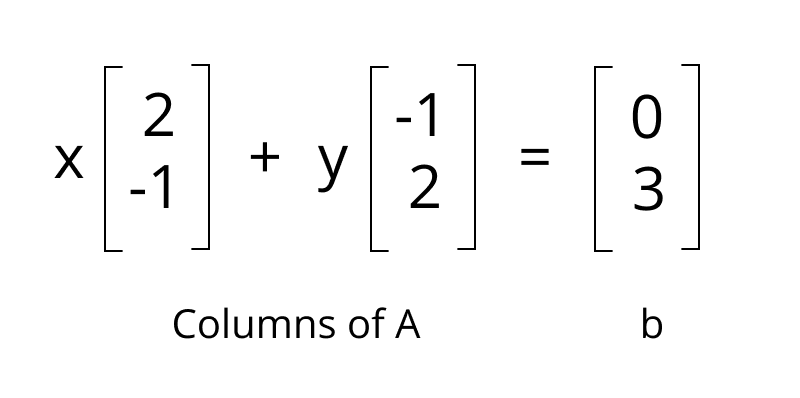

And now what is the equation asking for?

**It's asking us to find somehow to combine those vectors - the col1 [2, -1], col2 [-1, 2].** 

**It means it is asking us to find the right linear combination.**

### Linear Combination of columns

This is the most fundamental operation in the whole course.

Multiplying col1, col2 by some numbers and adding it, we call it **linear combination**.

And here, we want to make x, y, which are the right numbers to produce **b [0, 3]**

Drawing the picture of it as the geometry, we can plot like this.

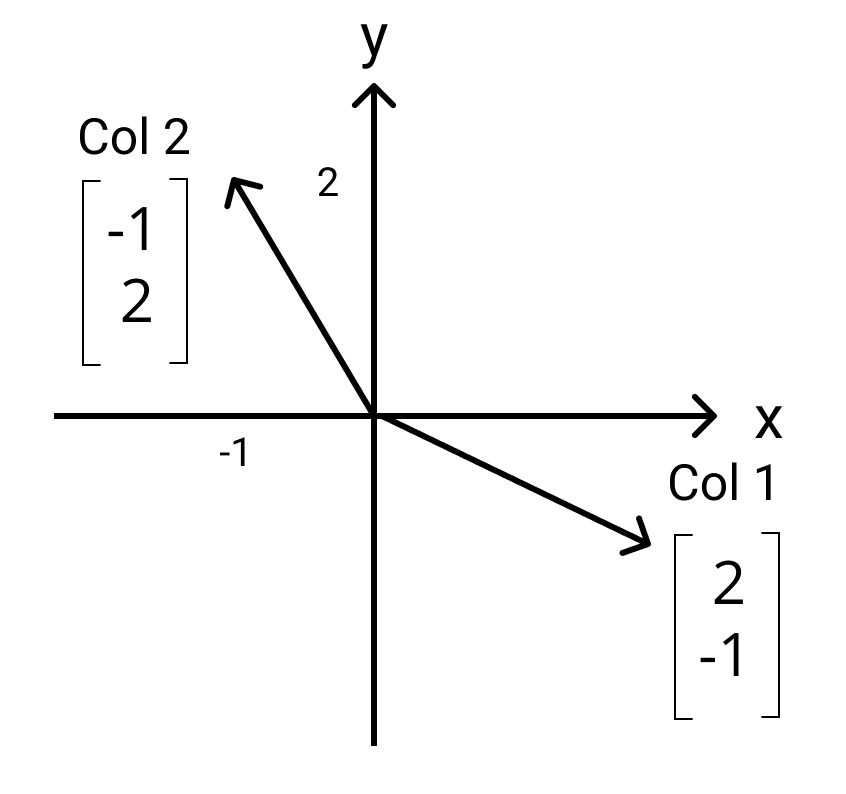

And finally we can get the right answer like this.

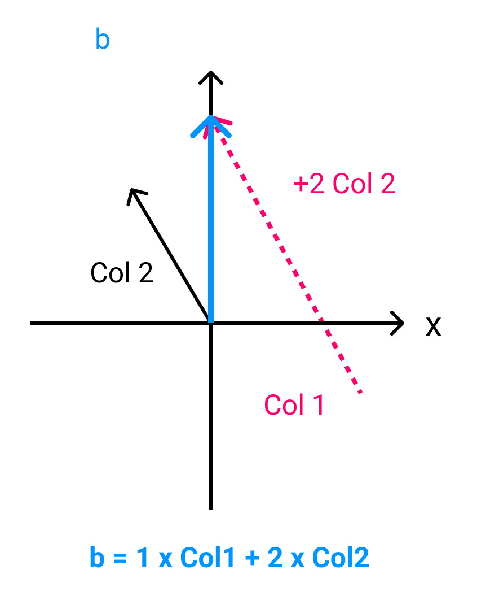

The point is that, we've done this with columns as a **component**.

**If I took all the xs and all the ys(all the combinations), what would be the result to get the right-hand side at all?**

> What Linear Combination gives b and what do all the linear combinations give? what are all the possible achievable right-hand side b!(edit)

=> That's gonna be basic

Let's move to the equations and 3 unknowns.

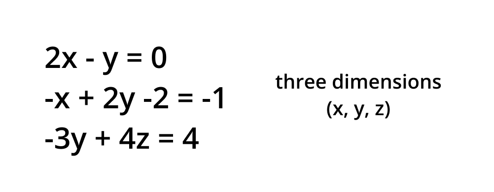

As we've done, there are three ways to understand this equations.

> Row Picture

> Column Picture

> Matrix Form

Let just take a matrix form first.

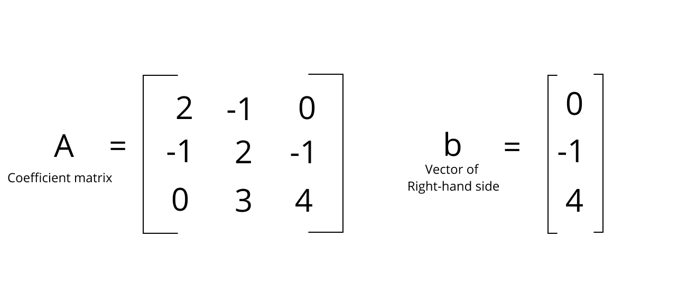

## Row Picture

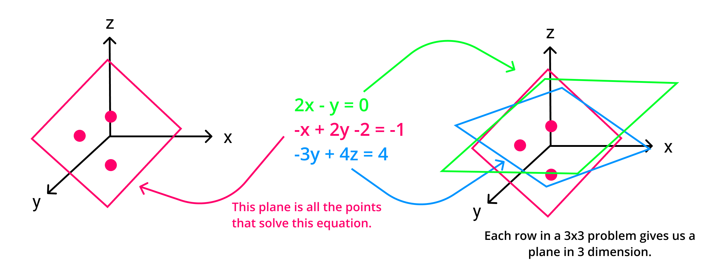

> When two equations(the two planes) meet in three dimension, they meet in a line.

> If three planes are not parallel and they're not special, they do meet in one point and that's a ***solution***.

**The problem is, the row picture is hard to see and it's not so clear.** So, we'll move to column picture to this.

## Column Picture

Below, this is a linear combination of three vectors, each is a three dimensional vector.

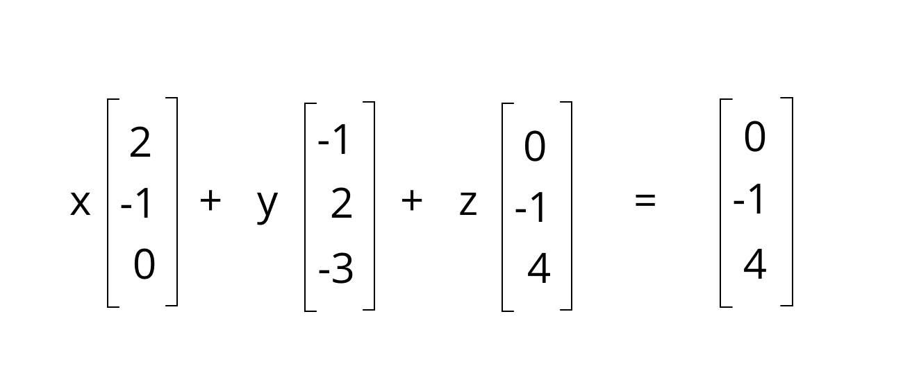

Since the problem is sepcially choosen to be

**b = one of these columns(=col3)**

we can get the solution of

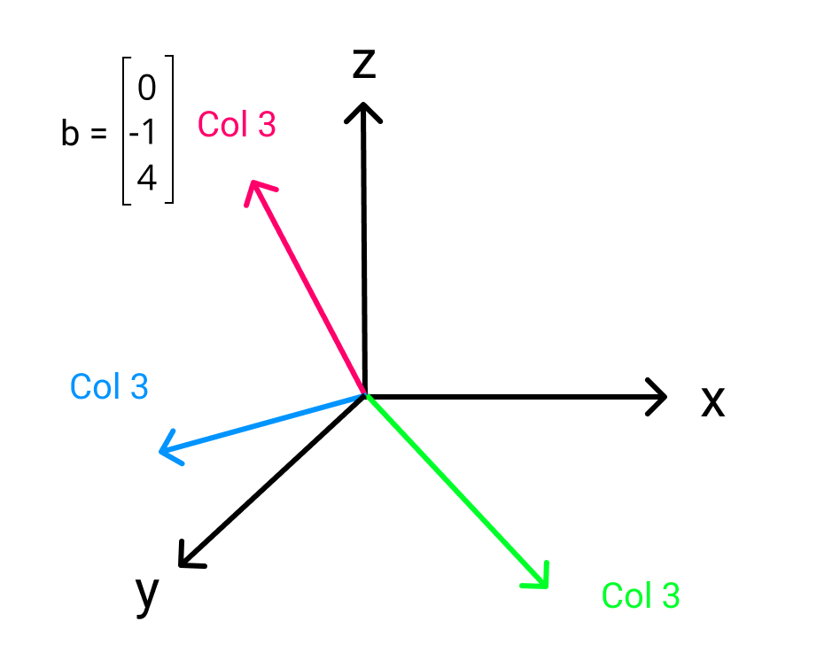

> x = 0, y = 0, z = 1

Of course I won't always be able to see it from the column picture either.

Then how to get the solution?

That's the next lecture, about the **elimination**, which is the systematic way that every bit of software also do to solve the equations. Next lecture will be about how to find x, y, z in all cases.

## Think again about the big picture.

if we change right-hand side as [1, 1, -3], we can express this as

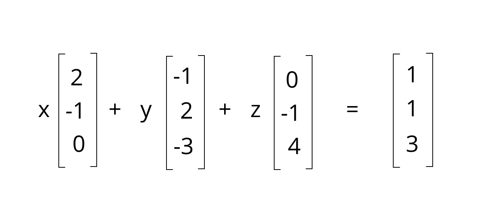

We can find solution easily since we set this also specially that the solution is just adding column 1 and column 2 without column3.

> x = 1, y = 1, z = 0

In the **row picture**, we have three ***different new*** planes, meeting new at this point. 

In the **column picture**, I have the ***same*** three columns, so now I'm just combining them to produce b and turned out col1 + col2 = b.

Now, there can be a question.

## Can I solve **Ax = b** for every b?
is there a solution for every right-hand side?

If we put this in different words in this linear combination words, we can say

## = Do the Linear Combinations of the columns fill 3D Space?

