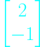
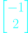

# Lec 1. The Geometry of Linear Eqautions

## Linear Algebra, Gilbert Strang. MIT Lecture 2005 Spring

## Edited By Steve Ive
This article is based on Gilbert Strang's lecture script. The article will be described according to the flow of the lecture.

---

What's in the first lecture? The fundamental problem of linear algebra, which is to solve a system of linear equations. So Let's start with a case when we have some numbers of equations, say **n equations and n unknowns**. So the equal number of equations and unknowns. That's the normal nice case. And what I want to do is with examples, of course to describe, first, what I call the **Row picture**. That's the picture of one equation at a time. It's the picture you'be seen before in two by two equations where lines meet. So in a minute, you'll see lines meeting. 

The second picture, I'll put a star beside that, because that's such an important one. And maybe new to you is the picture -- a column at a time, the **Column Picture**. And those are the rows and columns of a matrix.

So the third -- the algebra way to look at the problem is the **matrix form** and using a matrix that I'll call A.

The core of the thing is that we will see through problem with the new sight of **Column Picture** which is the ***linear combination*** of the columns of matrix.

---

### The Things we are going to cover this lecture

#### The pictures of how to see the problem.

- Row Picture

- **Column Picture**

- Matrix Form

#### Can I solve Ax = b for every b? 
(every b means the all the bs in three dimentional space)

- Singular, non-Singular

#### The way of matrix mulitplication

- Row picture: The Dot Product

- Column Picture: **The Linear Combination**.

So, let's take an example.

---

## 2 equations, 2 unknowns

At above, we can see the problem that consists two equations and two unknowns.

**Before the picture of it**, Let just first describe this as matrix form.

So what's the coefficient matrix? Anyway what is the matrix though?

The matrix is **just a rectangular array of numbers.**

Here, we have the coefficient matrix on the left side, We'll call it ***A***.

Also, we have the vector that contains two components, the unknowns x, y. We will call this as ***X***.

On the right side hand, we have the vector that contains 0 and 3. And we will call this as ***b***

So, We can describe this though.

So the linear equations are now the AX = b.

And the idea now, that to solve this particular problem and then step back to see the bigger picture. Okay. What's the picture for this example, the Row Picture?

## Row Picture

Okay, so here comes the Row picture. So that means I take one row at a time and I'm drawing here the xy plane and I'm going to plot all the points that satisfy that first equation.

The Points that satisfy this first equation, 

- x = 0, y = 0
- x = 1, y = 2

The Points that satisfy this second equation, 

- x = -1, y = 1
- x = -3, y = 0

So there's the points that solve these equation. And I could put in more points.
But, but let me put in all the points at once, because they all lie on a straight line.

As above, the point that lies both lines is the important thing, the solution.

**Solution**
- x = 1, y= 2

So, first of all, for n equal 2, two equations and two unknowns, we've seen the row picture first and it's the right place to start.

Okay.

So we've got the solution.

The point that lies on both lines.

Now can I come to the column picture?

Pay attention, this is the key point.

So the column picture.

## Column Picture

I'm now going to look at the columns of the matrix.

I'm going to look at this part  and this part .

I'm kind of getting the two equations at once --

And now what is the equation asking for?

It's asking us to find -- somehow to combine that vector and this one in the right amounts to get that one.
It's asking us to find the right linear combination -- this is called a ***linear combination***.
And it's the most fundamental operation in the whole course.
It's a linear combination of the columns.
That's what we're seeing on the left side.
Again, I don't want to write down a big definition.
You can see what it is.

There's column one, there's column two.

I multiply by some numbers and I add.

That's a combination -- a linear combination and I want to make

those numbers the right numbers to produce zero three.

Okay.

Now I want to draw a picture that, represents what this -- (this was algebra).
What's the geometry, what's the picture that goes with it?
Okay.
So again, these vectors have two components,
so I better draw a picture like that.
So can I put down these columns?
I'll draw these columns as they are,
and then I'll do a combination of them.
So the first column is over two and down one, right?
So there's the first column.
The first column.
Column one.
It's the vector two minus one.
The second column is --
minus one is the first component and up two.
It's here.
There's column two.
So this, again, you see what its components are.
Its components are minus one, two.
Good.
That's this guy.
Now I have to take a combination.
What combination shall I take?
Why not the right combination, what the hell?
Okay.
So the combination I'm going to take
is the right one to produce zero three
and then we'll see it happen in the picture.
So the right combination is to take x as one of those
and two of these.
It's because we already know that that's the right x and y,
so why not take the correct combination here and see it
happen?
Okay, so how do I picture this linear combination?
So I start with this vector that's already here --
so that's one of column one, that's one times column
one, right there.
And now I want to add on -- so I'm going to hook the next
vector onto the front of the arrow will start the next
vector and it will go this way.
So let's see, can I do it right?
If I added on one of these vectors,
it would go left one and up two, so we'd go left one and up two,
so it would probably get us to there.
Maybe I'll do dotted line for that.
Okay?
That's one of column two tucked onto the end,
but I wanted to tuck on two of column two.
So that -- the second one -- we'll go up left one and up two
also.
It'll probably end there.
And there's another one.
So what I've put in here is two of column two.
Added on.
And where did I end up?
What are the coordinates of this result?
What do I get when I take one of this plus two of that?
I do get that, of course.
There it is, x is zero, y is three, that's b.
That's the answer we wanted.
And how do I do it?
You see I do it just like the first component.
I have a two and a minus two that produces a zero,
and in the second component I have a minus one and a four,
they combine to give the three.
But look at this picture.
So here's our key picture.
I combine this column and this column to get this guy.
That was the b.
That's the zero three.
Okay.
So that idea of linear combination is crucial,
and also --
do we want to think about this question?
Sure, why not.
What are all the combinations?
If I took -- can I go back to xs and ys?
This is a question for really --
it's going to come up over and over,
but why don't we see it once now?
If I took all the xs and all the ys, all the combinations,
what would be all the results?
And, actually, the result would be
that I could get any right-hand side at all.
The combinations of this and this
would fill the whole plane.
You can tuck that away.
We'll, explore it further.
But this idea of what linear combination gives b and what do
all the linear combinations give,
what are all the possible, achievable right-hand sides be
-- that's going to be basic.
Okay.
Can I move to three equations and three unknowns?
Because it's easy to picture the two by two case.
Let me do a three by three example.
Okay, I'll sort of start it the same way,
say maybe 2x-y and maybe I'll take no zs as a zero and maybe
a -x 2y and maybe a -z as a -- oh,
let me make that a minus one and, just for variety let me
take, -3z, -3ys, I should keep the ys in that line,
and 4zs is, say, 4.
Okay.
That's three equations.
I'm in three dimensions, x, y, z.
And, I don't have a solution yet.
So I want to understand the equations and then solve them.
Okay.
So how do I you understand them?
The row picture one way.
The column picture is another very important way.
Just let's remember the matrix form, here,
because that's easy.
The matrix form -- what's our matrix A?
Our matrix A is this right-hand side, the two and the minus one
and the zero from the first row, the minus one and the two
and the minus one from the second row,
the zero, the minus three and the four from the third row.
So it's a three by three matrix.
Three equations, three unknowns.
And what's our right-hand side?
Of course, it's the vector, zero minus one, four.
Okay.
So that's the way, well, that's the short-hand to write out
the three equations.
But it's the picture that I'm looking for today.
Okay, so the row picture.
All right, so I'm in three dimensions, x,
find out when there isn't a solution.
y and z.
And I want to take those equations one at a time and ask
--
and make a picture of all the points that satisfy --
let's take equation number two.
If I make a picture of all the points that satisfy --
all the x, y, z points that solve this equation --
well, first of all, the origin is not one of them.
x, y, z -- it being 0, 0, 0 would not solve that equation.
So what are some points that do solve the equation?
Let's see, maybe if x is one, y and z could be zero.
That would work, right?
So there's one point.
I'm looking at this second equation,
here, just, to start with.
Let's see.
Also, I guess, if z could be one,
x and y could be zero, so that would just
go straight up that axis.
And, probably I'd want a third point here.
Let me take x to be zero, z to be zero,
then y would be minus a half, right?
So there's a third point, somewhere -- oh my -- okay.
Let's see.
I want to put in all the points that satisfy that equation.
Do you know what that bunch of points will be?
It's a plane.
If we have a linear equation, then, fortunately,
the graph of the thing, the plot of all the points that solve it
are a plane.
These three points determine a plane,
but your lecturer is not Rembrandt
and the art is going to be the weak point here.
So I'm just going to draw a plane, right?
There's a plane somewhere.
That's my plane.
That plane is all the points that solves this guy.
Then, what about this one?
Two x minus y plus zero z.
So z actually can be anything.
Again, it's going to be another plane.
Each row in a three by three problem
gives us a plane in three dimensions.
So this one is going to be some other plane --
maybe I'll try to draw it like this.
And those two planes meet in a line.
So if I have two equations, just the first two
equations in three dimensions, those give me a line.
The line where those two planes meet.
And now, the third guy is a third plane.
And it goes somewhere.
Okay, those three things meet in a point.
Now I don't know where that point is, frankly.
But -- linear algebra will find it.
The main point is that the three planes, because they're not
parallel, they're not special.
They do meet in one point and that's the solution.
But, maybe you can see that this row picture is
getting a little hard to see.
The row picture was a cinch when we looked at two lines
meeting.
When we look at three planes meeting,
it's not so clear and in four dimensions probably
a little less clear.
So, can I quit on the row picture?
Or quit on the row picture before I've successfully
found the point where the three planes meet?
All I really want to see is that the row picture consists
of three planes and, if everything works right,
three planes meet in one point and that's a solution.
Now, you can tell I prefer the column picture.
Okay, so let me take the column picture.
That's x times --
so there were two xs in the first equation minus one x is,
and no xs in the third.
It's just the first column of that.
And how many ys are there?
There's minus one in the first equations, two in the second
and maybe minus three in the third.
Just the second column of my matrix.
And z times no zs minus one zs and four zs.
And it's those three columns, right,
that I have to combine to produce the right-hand side,
which is zero minus one four.
Okay.
So what have we got on this left-hand side?
A linear combination.
It's a linear combination now of three vectors,
and they happen to be -- each one is a three dimensional
vector, so we want to know what combination of those three
vectors produces that one.
Shall I try to draw the column picture, then?
So, since these vectors have three components --
so it's some multiple -- let me draw in the first column
as before --
x is two and y is minus one.
Maybe there is the first column.
y -- the second column has maybe a minus one and a two and the y
is a minus three, somewhere, there possibly, column two.
And the third column has --
no zero minus one four, so how shall I draw that?
So this was the first component.
The second component was a minus one.
Maybe up here.
That's column three, that's the column zero minus one and four.
This guy.
So, again, what's my problem?
What this equation is asking me to do
is to combine these three vectors
with a right combination to produce this one.
Well, you can see what the right combination is, because
in this special problem, specially chosen
by the lecturer, that right-hand side that I'm trying to get
is actually one of these columns.
So I know how to get that one.
So what's the solution?
What combination will work?
I just want one of these and none of these.
So x should be zero, y should be zero and z should
be one.
That's the combination.
One of those is obviously the right one.
Column three is actually the same
as b in this particular problem.
I made it work that way just so we
would get an answer, (0,0,1), so somehow that's
the point where those three planes met
and I couldn't see it before.
Of course, I won't always be able to see it from the column
picture, either.
It's the next lecture, actually, which is about elimination,
which is the systematic way that everybody --
every bit of software, too --
production, large-scale software would solve the equations.
So the lecture that's coming up.
If I was to add that to the syllabus,
will be about how to find x, y, z in all cases.
Can I just think again, though, about the big picture?
By the big picture I mean let's keep this same matrix
on the left but imagine that we have
a different right-hand side.
Oh, let me take a different right-hand side.
So I'll change that right-hand side
to something that actually is also pretty special.
Let me change it to --
if I add those first two columns,
that would give me a one and a one and a minus three.
There's a very special right-hand side.
I just cooked it up by adding this one to this one.
Now, what's the solution with this new right-hand side?
The solution with this new right-hand side is clear.
took one of these and none of those.
So actually, it just changed around to this
when I took this new right-hand side.
Okay.
So in the row picture, I have three different planes,
three new planes meeting now at this point.
In the column picture, I have the same three columns,
but now I'm combining them to produce this guy,
and it turned out that column one plus column two which would
be somewhere -- there is the right column --
one of this and one of this would give me the new b.
Okay.
So we squeezed in an extra example.
But now think about all bs, all right-hand sides.
Can I solve these equations for every right-hand side?
Can I ask that question?
So that's the algebra question.
Can I solve A x=b for every b?
Let me write that down.
Can I solve A x =b for every right-hand side b?
I mean, is there a solution?
And then, if there is, elimination
will give me a way to find it.
I really wanted to ask, is there a solution
for every right-hand side?
So now, can I put that in different words --
in this linear combination words?
So in linear combination words, do the linear combinations
of the columns fill three dimensional space?
Every b means all the bs in three dimensional space.
Do you see that I'm just asking the same question
in different words?
Solving A x --
A x -- that's very important.
A times x -- when I multiply a matrix by a vector,
I get a combination of the columns.
I'll write that down in a moment.
But in my column picture, that's really what I'm doing.
I'm taking linear combinations of these three columns
and I'm trying to find b.
And, actually, the answer for this matrix will be yes.
For this matrix A -- for these columns, the answer is yes.
This matrix -- that I chose for an example is a good matrix.
A non-singular matrix.
An invertible matrix.
Those will be the matrices that we like best.
There could be other --
and we will see other matrices where the answer becomes, no --
oh, actually, you can see when it would become no.
What could go wrong? find out -- because if elimination fails,
How could it go wrong that out of these --
out of three columns and all their combinations --
when would I not be able to produce some b off here?
When could it go wrong?
Do you see that the combinations --
let me say when it goes wrong.
If these three columns all lie in the same plane,
then their combinations will lie in that same plane.
So then we're in trouble.
If the three columns of my matrix --
if those three vectors happen to lie in the same plane --
for example, if column three is just
the sum of column one and column two, I would be in trouble.
That would be a matrix A where the answer would be no,
because the combinations --
if column three is in the same plane as column one and two,
I don't get anything new from that.
All the combinations are in the plane and only right-hand sides
b that I could get would be the ones in that plane.
So I could solve it for some right-hand sides, when
b is in the plane, but most right-hand sides
would be out of the plane and unreachable.
So that would be a singular case.
The matrix would be not invertible.
There would not be a solution for every b.
The answer would become no for that.
Okay.
I don't know --
shall we take just a little shot at thinking
about nine dimensions?
Imagine that we have vectors with nine components.
Well, it's going to be hard to visualize those.
I don't pretend to do it.
But somehow, pretend you do.
Pretend we have -- if this was nine equations and nine
unknowns, then we would have nine columns,
and each one would be a vector in nine-dimensional space
and we would be looking at their linear combinations.
So we would be having the linear combinations
of nine vectors in nine-dimensional space,
and we would be trying to find the combination that hit
the correct right-hand side b.
And we might also ask the question can we always do it?
Can we get every right-hand side b?
And certainly it will depend on those nine columns.
Sometimes the answer will be yes --
if I picked a random matrix, it would be yes, actually.
If I used MatLab and just used the random command, picked
out a nine by nine matrix, I guarantee it would be
good.
It would be non-singular, it would
be invertible, all beautiful.
But if I choose those columns so that they're not independent,
so that the ninth column is the same as the eighth column,
then it contributes nothing new and there
would be right-hand sides b that I couldn't get.
Can you sort of think about nine vectors
in nine-dimensional space an take their combinations?
That's really the central thought --
that you get kind of used to in linear algebra.
Even though you can't really visualize it,
you sort of think you can after a while.
Those nine columns and all their combinations
may very well fill out the whole nine-dimensional space.
But if the ninth column happened to be the same as the eighth
column and gave nothing new, then probably what it would
fill out would be --
I hesitate even to say this -- it would be a sort of a plane
--
an eight dimensional plane inside nine-dimensional space.
And it's those eight dimensional planes
inside nine-dimensional space that we
have to work with eventually.
For now, let's stay with a nice case where the matrices work,
we can get every right-hand side b and here
we see how to do it with columns.
Okay.
There was one step which I realized
I was saying in words that I now want to write in letters.
Because I'm coming back to the matrix form of the equation,
so let me write it here.
The matrix form of my equation, of my system
is some matrix A times some vector x
equals some right-hand side b.
Okay.
So this is a multiplication.
A times x.
Matrix times vector, and I just want to say
how do you multiply a matrix by a vector?
Okay, so I'm just going to create a matrix --
let me take two five one three --
and let me take a vector x to be, say, 1and 2.
How do I multiply a matrix by a vector?
But just think a little bit about matrix notation
and how to do that in multiplication.
So let me say how I multiply a matrix by a vector.
Actually, there are two ways to do it.
Let me tell you my favorite way.
It's columns again.
It's a column at a time.
For me, this matrix multiplication
says I take one of that column and two of that column and add.
So this is the way I would think of it
is one of the first column and two of the second column
and let's just see what we get.
So in the first component I'm getting a two and a ten.
I'm getting a twelve there.
In the second component I'm getting a one and a six,
I'm getting a seven.
So that matrix times that vector is twelve seven.
Now, you could do that another way.
You could do it a row at a time.
And you would get this twelve -- and actually I pretty much did
it here --
this way.
Two -- I could take that row times my vector.
This is the idea of a dot product.
This vector times this vector, two times one plus five times
two is the twelve.
This vector times this vector -- one times one plus three times
two is the seven.
So I can do it by rows, and in each row times
my x is what I'll later call a dot product.
But I also like to see it by columns.
I see this as a linear combination of a column.
So here's my point.
A times x is a combination of the columns of A.
That's how I hope you will think of A times x when we need
it.
Right now we've got -- with small ones,
we can always do it in different ways, but later,
think of it that way.
Okay.
So that's the picture for a two by two system.
And if the right-hand side B happened to be twelve seven,
then of course the correct solution would be one two.
Okay.
So let me come back next time to a systematic way,
using elimination, to find the solution, if there is one,
to a system of any size and find out--
because the system-- because if elimination fails--
find out when there isn't a solution.
Okay.
Thanks.
