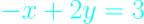

# Lec 1. The Geometry of Linear Eqautions

## Linear Algebra, Gilbert Strang. MIT Lecture 2005 Spring

## Edited By Steve Ive
This article is based on Gilbert Strang's lecture script. The article will be described according to the flow of the lecture.

---

What's in the first lecture? The fundamental problem of linear algebra, which is to solve a system of linear equations. So Let's start with a case when we have some numbers of equations, say **n equations and n unknowns**. So the equal number of equations and unknowns. That's the normal nice case. And what I want to do is with examples, of course to describe, first, what I call the **Row picture**. That's the picture of one equation at a time. It's the picture you'be seen before in two by two equations where lines meet. So in a minute, you'll see lines meeting. 

The second picture, I'll put a star beside that, because that's such an important one. And maybe new to you is the picture -- a column at a time, the **Column Picture**. And those are the rows and columns of a matrix.

So the third -- the algebra way to look at the problem is the **matrix form** and using a matrix that I'll call A.

The core of the thing is that we will see through problem with the new sight of **Column Picture** which is the ***linear combination*** of the columns of matrix.

--

### The Things we are going to cover this lecture

#### The pictures of how to see the problem.

- Row Picture

- **Column Picture**

- Matrix Form

#### Can I solve Ax = b for every b? 
(every b means the all the bs in three dimentional space)

- Singular, non-Singular

#### The way of matrix mulitplication

- Row picture: The Dot Product

- Column Picture: **The Linear Combination**.

So, let's take an example.

---

## 2 equations, 2 unknowns

