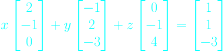

# Lec 1. The Geometry of Linear Eqautions

## Linear Algebra, Gilbert Strang. MIT Lecture 2005 Spring

## Edited By Steve Ive
This article is based on Gilbert Strang's lecture script. The article will be described according to the flow of the lecture.

---

What's in the first lecture? The fundamental problem of linear algebra, which is to solve a system of linear equations. So Let's start with a case when we have some numbers of equations, say **n equations and n unknowns**. So the equal number of equations and unknowns. That's the normal nice case. And what I want to do is with examples, of course to describe, first, what I call the **Row picture**. That's the picture of one equation at a time. It's the picture you'be seen before in two by two equations where lines meet. So in a minute, you'll see lines meeting. 

The second picture, I'll put a star beside that, because that's such an important one. And maybe new to you is the picture -- a column at a time, the **Column Picture**. And those are the rows and columns of a matrix.

So the third -- the algebra way to look at the problem is the **matrix form** and using a matrix that I'll call A.

The core of the thing is that we will see through problem with the new sight of **Column Picture** which is the ***linear combination*** of the columns of matrix.

---

### The Things we are going to cover this lecture

#### The pictures of how to see the problem.

- Row Picture

- **Column Picture**

- Matrix Form

#### Can I solve Ax = b for every b? 
(every b means the all the bs in three dimentional space)

- Singular, non-Singular

#### The way of matrix mulitplication

- Row picture: The Dot Product

- Column Picture: **The Linear Combination**.

So, let's take an example.

---

## 2 equations, 2 unknowns

At above, we can see the problem that consists two equations and two unknowns.

**Before the picture of it**, Let just first describe this as matrix form.

Anyway what is the matrix though?

The matrix is **just a rectangular array of numbers.**

Here, we have the coefficient matrix on the left side, We'll call it ***A***.

Also, we have the vector that contains two components, the unknowns x, y. We will call this as ***X***.

On the right side hand, we have the vector that contains 0 and 3. And we will call this as ***b***

So, We can describe this though.

So the linear equations are now the form of ***AX = b***.

The idea now, is that to solve this particular problem, and then step back to see the bigger picture. 

Okay. What's the picture for this example, the Row Picture?

## Row Picture

Okay, so here comes the Row picture. 

The Row Picture means that I **take one row at a time**. It means that we will focus on the row of the matrix, which also mean that we foucs on one equation at a time.

So let's dive in to this two equations and let's find some points that satisfy those equations.

**Equation 1**

**Equation 2**

The points that satisfying the equation 1.

- x = 0, y = 0
- x = 1, y = 2

The points that satisfying the equation 1.

- x = -1, y = 1
- x = -3, y = 0

So there's the points that solve these equation and I could put in more points. But, let me put in all the points at once, because they all lie on a straight line.

As above, the point that lies both lines is the important thing, the solution.

**Solution**
- x = 1, y= 2

So, the first thing we've done for n equal 2, two equations and two unknowns, we've seen the row picture and it's the right place to start.

Okay. We've got the solution that the point that lies on both lines.

Now can I come to the column picture?

Pay attention, this is the key point.

So the column picture.

## Column Picture

I'm now going to look at the columns of the matrix.

We can describe the problem the combination of the columns. And we call it the ***Linear Combination***.

And it's the most fundamental operation in the whole course.

**It's a linear combination of the columns.**

The thing we are going to do is just find appropriate x and y to produce the right right-hand side vector, the [0,3].

So let's go to the geometry of this.

As above, we can describe the two columns.

By **Linear Combination**, we will solve this by multiplying some appropriate numbers to these columns, and adding it.

As above, we can get the right answer, the b of [0,3] by multiplying and adding two columns.

So, now, we can think about "Can we get all the xs and ys to all the bs in the 2-dimension?"

It means, that, "can we get the result of xs and ys that can pointing all the points in this 2-dimension?"

It is important to think that. We will cover that later.

So, Let's go to the next example, the 3 equations, and 3 unknowns.

## 3 equations, 3 unknowns

Let' see the Row picture first.

## Row Picture

When we find some points that satisfying each equations, we would get three different planes in the 3-dimensional space.

When two planes meet, those meet in the **line**.

When three planes meet, those meet in the **point**.

And the point of that will be the answer of these equations.

But, maybe you can see that this row picture is getting a little hard to see.

The row picture was a cinch when we looked at two planes meeting.

When we look at three planes meeting,it's not so clear and in four dimensions probably a little less clear.

So, let's quit the row picture.

All I really want to see is that the row picture consists of three planes and, if everything works right, three planes meet in one point and that's a solution.

Now, you can tell I prefer the column picture.

Okay, so let me take the column picture.

## Column Picture

So, let's start with describing the matrix form first.

For the column picture, we can describe this as below.

So the left hand side, what we've got?

It's a ***Linear Combination***. It's a linear combination of three vectors, and they happen to be each one is a three dimensional
vector, so we want to know what combination of those three vectors produces that one.

Shall I try to draw the column picture, then?

So, again, what's my problem? What this equation is asking me to do is to combine these three vectors with a right combination to produce this one.

Well, you can see what the right combination is, because in this special problem, specially chosen by the lecturer, that right-hand side that I'm trying to get is actually one of these columns. So I know how to get that one.

So what's the solution?

What combination will work?

I just want ***column3*** and none of ***column1*** and ***column2***.

So x should be zero, y should be zero and z should be one. That's the combination.

One of those is obviously the right one. Column three is actually the same as b in this particular problem.

I made it work that way just so we would get an answer, (0,0,1), so somehow that's the point where those three planes met and I couldn't see it before.

Of course, I won't always be able to see it from the column picture, either.

It's the next lecture, actually, which is about ***elimination***, which is the systematic way that everybody, every bit of software, production, large-scale software would solve the equations.

So the lecture that's coming up.

Can I just think again, though, about the big picture?

By the big picture I mean let's keep this same matrix on the left but imagine that we have a different right-hand side.
So I'll change that right-hand side to something that actually is also pretty special. 

Let me change it to if I add first column and second column, that would give me a one and a one and a minus three.

There's a very special right-hand side. I just cooked it up by adding this one to this one.

Now, what's the solution with this new right-hand side?

The solution with this new right-hand side is clear. Took one of components of ***column1*** and ***columns2*** and none of ***columns3***.

So actually, it just changed around to this when I took this new right-hand side.

Okay.

- So in the row picture, **I have three different planes**, three **new planes** meeting now at this point.

- In the column picture, I have the **same three columns**, but now I'm combining them to produce the b, and it turned out that column one plus column two.

Okay. So we squeezed in an extra example.

But now think about all bs, all right-hand sides.

Can I solve these equations for every right-hand side? 

So that's the algebra question.

Can I solve A x=b for every b?

Let me write that down.

## Can I solve A x =b for every right-hand side b?

I mean, is there a solution?

And then, if there is, elimination will give me a way to find it.

I really wanted to ask, is there a solution for every right-hand side?

So now, can I put that in different words in this linear combination words?

So in linear combination words, 

## do the linear combinations of the columns fill three dimensional space?

Every b means all the bs in three dimensional space.

Do you see that I'm just asking the same question in different words?
Solving Ax - that's very important.

A times x - when I multiply a matrix by a vector, I get a combination of the columns.

But in my column picture, that's really what I'm doing.

I'm taking **linear combinations** of these three columns and I'm trying to find b.

For this matrix A - for these columns, the answer is **yes**.

This matrix A, that I chose for an example is a good matrix.

- **A non-singular matrix.**

- **An invertible matrix.**

Those will be the matrices that we like best.

There could be other and we will see other matrices where the answer becomes, **no**.

## When the matrix become singular

If these three columns all lie in the same plane, then their combinations will lie in that same plane.

So then we're in trouble.

If the three columns of my matrix, if those three vectors happen to lie in the same plane,

for example, if column three is just the sum of column one and column two, I would be in trouble.

That would be a matrix A where the answer would be **no**, because the combinations, if column three is in the same plane as column one and two,

**I don't get anything new from that.**

All the combinations are in the plane and only right-hand sides b that I could get would be the ones in that plane.

So I could solve it for some right-hand sides, when b is in the plane, but most right-hand sides would be out of the plane and unreachable.

- **So that would be a singular case.**

- **The matrix would be not invertible.**

There would not be a solution for every b. The answer would become no for that.

Shall we take just a little shot at thinking about nine dimensions? Imagine that we have vectors with nine components.
Well, it's going to be hard to visualize those. I don't pretend to do it.  But somehow, pretend you do.
Pretend we have - if this was nine equations and nine unknowns, then we would have nine columns, and each one would be a vector in nine-dimensional space
and we would be looking at their linear combinations.

So we would be having the linear combinations of nine vectors in nine-dimensional space, and we would be trying to find the combination that hit the correct right-hand side b.

And we might also ask the question can we always do it? Can we get every right-hand side b?

**And certainly it will depend on those nine columns.**

Sometimes the answer will be **yes** --if I picked a random matrix, it would be yes, actually.

If I used MatLab and just used the random command, picked out a nine by nine matrix, I guarantee it would be good.

It would be non-singular, it would be invertible, all beautiful.

**But if I choose those columns so that they're not independent,** so that the ninth column is the same as the eighth column, then it contributes nothing new and there would be right-hand sides b that I couldn't get.

Can you sort of think about nine vectors in nine-dimensional space an take their combinations? That's really the central thought -- that you get kind of used to in linear algebra.

Even though you can't really visualize it, you sort of think you can after a while. Those nine columns and all their combinations may very well fill out the whole nine-dimensional space. But if the ninth column happened to be the same as the eighth column and gave nothing new, then probably what it would
fill out would be - I hesitate even to say this - it would be a sort of a plane - an eight dimensional plane inside nine-dimensional space.

And it's those eight dimensional planes inside nine-dimensional space that we have to work with eventually.

For now, let's stay with a nice case where the matrices work, we can get every right-hand side b and here we see how to do it with columns.

Okay.

## The Matrix form

The matrix form of my equation, of my system is some matrix A times some vector x equals some right-hand side b.

Okay.

So this is a multiplication.

A times x.

Matrix times vector, and I just want to say how do you multiply a matrix by a vector?

Okay, so I'm just going to create a matrix, let me take two five one three --
and let me take a vector x to be, say, 1and 2.

**How do I multiply a matrix by a vector?**

But just think a little bit about matrix notation and how to do that in multiplication. So let me say how I multiply a matrix by a vector.

**Actually, there are two ways to do it.**

Let me tell you my favorite way. It's columns again. It's a **column at a time**.

### Matrix Multiplication with Column Picture way

For me, this matrix multiplication says I take one of that column and two of that column and add.

So this is the way I would think of it is one of the first column and two of the second column and let's just see what we get.

So in the first component I'm getting a two and a ten. I'm getting a twelve there.

In the second component I'm getting a one and a six, I'm getting a seven.

So that matrix times that vector is twelve seven.

Now, you could do that another way. You could do it a **row at a time**.

## Matrix Multiplication with sRow Picture way, the Dot Product

I could take that row times my vector.
This is the idea of a dot product.
This vector times this vector, two times one plus five times
two is the twelve.
This vector times this vector -- one times one plus three times
two is the seven.
So I can do it by rows, and in each row times
my x is what I'll later call a dot product.

But I also like to see it by columns. I see this as a linear combination of a column.

So here's my point.

## A times x is a combination of the columns of A.

That's how I hope you will think of A times x when we need it.

Right now we've got with small ones, we can always do it in different ways, but later, think of it that way.

Okay.

So that's the picture for a two by two system.

And if the right-hand side B happened to be twelve seven, then of course the correct solution would be one two.
Okay.

So let me come back next time to a systematic way, using **elimination**, to find the solution, if there is one, to a system of any size and find out.
if elimination fails, then find out when there isn't a solution.

Okay.

Thanks.

