# Lec 2.Elimination with Matrices

## Linear Algebra, Gilbert Strang. MIT Lecture 2005 Spring

## Edited By Steve Ive
This article is based on Gilbert Strang's lecture script. The article will be described according to the flow of the lecture.

---

Today on the Lecture, we are going to solve a system of equations with the method called 'Elimination'. The Elimination method is a way many computer package solve the equations, and well, if it succeeds, it gets the answer. Otherwise, we could fail to elimination and fail to find the answer. So we are going to talk about when the elimination succeed or fail. Also, to complete the answer, there's an obvious step called "back substitution". The part that I want to show you is the elimination expressed in matrix language, and one of the operations, of course, that we'll meet is how do we multiply matrices and why. So, let's dive in it with example.

---

### The Things we are going to cover this lecture

#### Elimination

- When the Elimination success

- When the Elimination fail

#### Back-Substitution

#### Elimination Matrices

#### Matrix Multiplication

---

Okay, Let's start with example. Here's a system of equations. Three equations and three unknowns. 

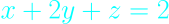

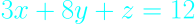

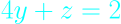

And we can describe those coefficients as matrix, the three by three matrix.

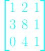

---

So this is the system Ax = b.

This is our system to solve, Ax equal the right-hand side is that vector 2, 12, 2. Okay.

## Elimination

Now, when I describe elimination, it gets to be a pain to keep writing the equal signs and the pluses and so on.

It's that matrix that totally matters. Everything is in that matrix. But behind it is those equations.

So what does elimination do? What's the first step of elimination?

We accept the first equation, it's okay.

I'm going to multiply that equation by the right number, the right multiplier and I'm going to subtract it from the second equation.

With what purpose? So that will decide what the multiplier should be.

**Our purpose is to knock out the x part of equation two. So our purpose is to eliminate x.**

So above, first we are going to multiply "3" to the first equation and subtract from the equation 2. The key number that we are starting with is called a "Pivot".

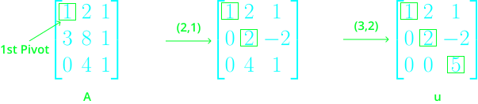

And now, after the eliminate the x of the second row, what we've got? the y, z.

So now, we are going to work with y and z. Everything is recursive. We will do same again.

So what do we want is to make 0 of "4" of row 3. Therefore, we should multiply the "2" to second row, and subtract from the third row.

Strictly saying, the multiplying "3" to first row can be "(2,1) step", since our elimination target was in row 2, column 1 (2,1).

Also, the multiplying "2" to the second row can be "(3,2) step", since our elimination target was in row 3, column2.

And the third pivot will gonna be the "5", the position of (3,3) at the row 3.

#### Take a moment!

> Pivot can't be a 0.

Since the Pivot can't be a zero, if the 0 was in the 1,1 position(row 1, column1), we should exchange our order of rows. What if other rows contains 0 in 1,1 position though? Then, we fail to elimination. And then we call the matrix is

***Invertible***, a ***Singular Matrix***.

So the there are a **temporal failure** and **complete failure** of elimination, the temporal failure is when our pivots are 0, and the complete failure is when our left rows cannot be exchanged since their position of pivots are 0 either.

---

So, now we are going to write the right-hand side vector along. As the flow that we've eliminated, the right-hand side vector can be as below.

Also, we can say the process of the elimination is the way of converting the matrix ***A to  U***, the ***U*** for the ***upper triangular*** and for the right-hand side vector converting the vector ***b to c***.

---

### Take a Moment!

**What is the upper triangular?**

In the mathematical discipline of linear algebra, a triangular matrix is a special kind of square matrix. A square matrix is called lower triangular if all the entries above the main diagonal are zero. Similarly, a square matrix is called upper triangular if all the entries below the main diagonal are zero.

Because matrix equations with triangular matrices are easier to solve, they are very important in numerical analysis. By the LU decomposition algorithm, an invertible matrix may be written as the product of a lower triangular matrix L and an upper triangular matrix U if and only if all its leading principal minors are non-zero.

https://en.wikipedia.org/wiki/Triangular_matrix

---

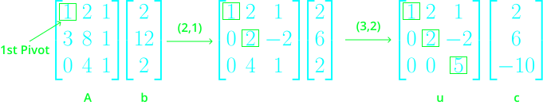

So, when we write our equations back from the derived matrix, we can write as

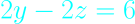

From here, we can find the answer. And here, we are going to do "Back Substitution".

## Back Substitution

Above equations, we can find the answer, from the last equation, to the very first equation. So we call it as "Back Substitution".

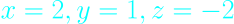

We can easliy find the z, the z is -2, and putting z to the second equation, we can find the y of 1, and finally we can find the x from the first equation of 2.

So you see what back substitution is.

**It's the simple step solving the equations in reverse order because the system is triangular.**

So, the first piece of the lecture is done. What is the second piece of the lecture then? We will operate our elimination step with matrix expression.

## Elimination Matrices

So, let just bring back that the matrix we want to eliminate.

How can we eliminate this matrix?

Well before that, let's point out something, since the matrix operation is able to see in a big picture. So, we are going to first point out about the matrix multiplication.

What was the thing in the first lecture?

We've said "the result of multiplying a matrix by some vector is a combination of the columns of the matrix".

### Matrix Multiplication for column operation

As we've seen in the last lecture, we can say the matrix multiply the vector can be seen as the combination of the matrix, the linear combination of the columns of the matrix.

so, suppose we multiply some matrix with the vector of 3, 4, 5.

We can express this as below.

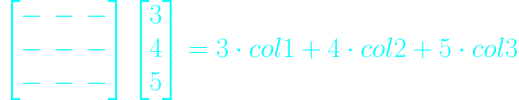

As you can see, we can express this as the "column picture", the column operation. But, what we need today is the row operation. I wrote this because I just wanted to emphasize the parallel thing of the row operation. So, let's go to the row operation.

### Matrix Multiplication for row operation

Suppose we have the matrix again, and multiply the vector on the left of containing 1, 2, 7.

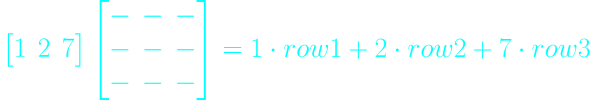

So, what's the output? What's the product of a row times a matrix? 

It's a row. What it's doing in this case is it's combining the rows.

And we have a combination, a linear combination of the rows.

---

So what we can find is that

#### ***Matrix times a column is a column.*** (Matrix x Column = Column)

#### ***Row times a Matrix is a row.***(Row x Matrix = Row)

As we do matrix multiplication, remember to keep your eye on what it's doing with whole vectors.

Okay, I want to use that.

---

### Back to Elimination Matrices

So, my question was what should we do with the matrix below.

Let's suppose the matrix above is ***A***.

The first step we should do was multiplying 3 to the row 1, and subtract it from the row 2. And after that, the matrix will be like below.

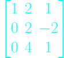

Let's suppose the matrix above is ***C***.

So what we want to do is to get the matrix ***B*** that produce ***C*** when multiplied by ***A***.

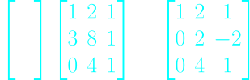

***BA = C***

So, here the way. The "row operation" we described can solve this problem. For the first row of A, we don't want to change anything. So the first row of the matrix B we should get will be [1, 0, 0]. For the second row of A, we want to multiply 3 to the first row and subtract it from the second row of A. So, the second row of B will gonna be [-3, 1, 0]. The third row of A either, we want to do nothing with it, so the third row of the matrix B will gonna be [0, 0, 1]. And those will gonna produce a matrix C.

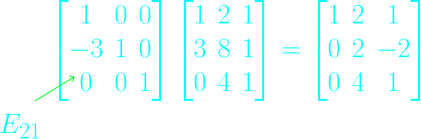

So that was the first step. and the matrix we've got, B, we can call it "E_21" since it is for elementary of elimination and we put the indices 2, 1 to it since it fixed the position of the 2, 1 of the matrix A.

What's next, the step 2, we should multiply 2 to the row 2, and subtract it from row 3. And the Matrix we should get will be called E_32, since it is the elementary or elimination matrix, and it is fixing the position of 3, 2(equivalent meaning with producing zero).

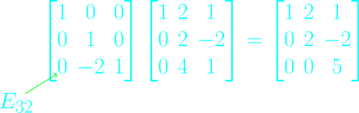

So, I've now given you the pieces, the elimination matrices, the elementary matrices that take each step.

---

So now what?

Now the next point in the lecture is to put those steps together into a matrix that does it all and see how it all happens.

So now I'm going to express the whole, everything we did today so far on A was to start with A, we multiplied it by E_21, that was the first step and then we multiplied that result by E_32 and that led us to this thing and what was that matrix?

### It's U.

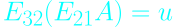

Okay.

Now there are important facts about matrix multiplication.

And we're close to maybe the most important. And that is this.

---

#### Suppose I ask you this question.

Suppose I start with a matrix A and I want to end with a matrix U. What matrix does the whole job?

What matrix takes me from A to U, using the letters I've got? And the answer is simple.

I'm not asking this as but it's highly important.

How would I create the matrix that does the whole job at once, that does all of elimination in one shot?

I would just put these together(E_32, E_21), right?

In other words, this is the thing I'm struggling to say. 

#### I can move those **parentheses**.

I can't mess around with the order of the matrices, but I can change the order that I do the multiplications.

It's saying multiply the Es first and that gives you the matrix that does everything at once.

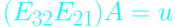

Okay.

So this fact, that this is automatically the same as this for every matrix multiplication, which I'm conscious of still not telling you in every detail, but, like, you're seeing how it works and this is highly important.

Tthe long word that describes this law for matrices, that you can move the parentheses is called the associative law.

Actually, we'll see so many steps in linear algebra, so many proofs, even, of main fact
come from just moving the parentheses.

And it's not that easy to prove that this is correct, you have to go into the gory details of matrix multiplication, do it both ways and see that you come out the same.
Maybe I'll leave the author to do that.

Okay. So there's a single matrix, I could call it E. 

While we're talking about these matrices, tell me one other. There's another type of ***elementary matrix***, and we already said why we might need it.

We didn't need it in this case. But it's the matrix that exchanges two rows.

It's called a ***permutation matrix***. So it's a little digession, but let me talk about the permutation matrix little.

## Permutation Matrix

### Permutation Matrix: Exchanging the rows

Suppose I want to find the matrix that exchanges those rows below.

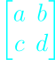

So we want the matrix that exchanges those rows, what I want is exchanging c, d with a b.

Let me call the that matrix as a permutation matrix P.

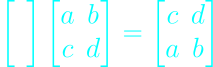

As the row operation, we want to get the second row of it, so the the top of the matrix P will be [0, 1] and the second row of the matrix P will be [1, 0]

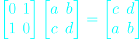

Actually, the easy way to find it is just do the thing to the identity matrix.

Exchange the rows of the identity matrix and then that's the matrix that will do row exchanges for you.

### Permutation Matrix: Exchanging the columns

Suppose I wanted to exchange columns instead. Columns have hardly got into today's lecture, but they certainly are going to be around.

Suppose I had my matrix below

and I want to get to a c over here and b d here.

What matrix does that job?

Can I cook up some matrix that produces that answer?

Can I put a matrix here on the left that will exchange columns?

And the answer is no.

I'm just bringing out again this point that when I multiply on the left, I'm doing **row operations**.

So if I want to do a column operation, where do I put that permutation matrix?

On the right.

If I put it on right, I'll exchange the two columns of the identity.

Then it comes out right, because now I'm multiplying a column at a time.

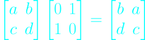

#### ***So, in short, to do column operations, the matrix multiplies on the right.***

#### ***To do row operations, it multiplies on the left.***

### Take a Moment!
> you can't exchange the orders of matrices.
And that's just the point I was making again here.

A times B is not the same as B times A.

You have to keep these matrices in their Gauss given order here, right?

But you can move the parentheses, so that, in other words, the commutative law, which
would allow you to take it in the other order is false.

So we have to keep it in that order.

---

So what next?

So let me come back to see what that was.

There were E_21 and E_32.

And if I multiply those two matrices together, E_32 and then E_21, I'll get a single matrix that does elimination.

I don't want to do it that -- if I do that multiplication -- there's a better way to do this.

And so in this last few minutes of today's lecture, can I anticipate that better way?

The better way is to think not how do I get from A to U, but how do I get from U back to A?

So reversing steps is going to come in.

Inverse -- I'll use the word inverse here.

## Inverse

So let me make the first step.
What's the inverse matrix?

All the matrices you've seen today have inverses.

I didn't write any bad matrices down.

We spoke about possible failure, and for a moment, we put in a matrix that would fail.

But right now, all these matrices are good, they're all invertible.
Let me say first what does the inverse mean and how to find it.

So we're getting a little leg up on inverses.

The example I'll take will be that E. So my matrix is below.

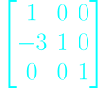

And I want to find the matrix that undoes that step.

So what was that step?

The step was subtract 3 times row one from row two.

So what matrix will get me back?

I want to find the matrix which undoes elimination, the matrix which multiplies A to give the identity.

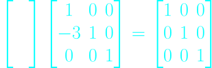

If this step subtracted 3 times row 1 from row 2, what's the inverse step?

I add 3 times row one to row two, right?

I add it back.

What I subtracted away, I add back.

So the inverse matrix in this case is now I want to add 3 times row one to row two, so I won't change row one, I won't change row three and I'll add 3 times row one to row two.

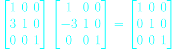

That's a case where the inverse is clear.

It just changed row two by subtracting 3 of row one.

And if we do that calculation, it comes out the right row of the identity.

So with the matrix E, and right side matrix is I for identity, then what's the notation for the left guy?

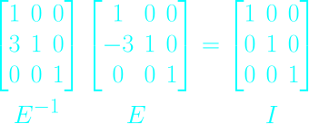

E to the minus one.

E inverse.

Okay.
Let's stop there for this lecture.
That's a little jump on what's coming on next Lecture.
So, see you on next lecture.
