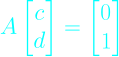
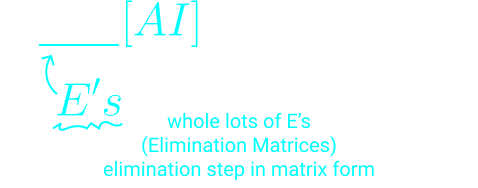
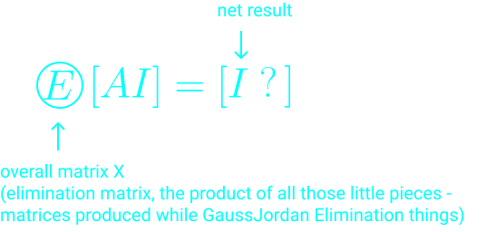
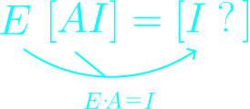

 # Lec 1. Multiplication and Inverse Matrices

## Linear Algebra, Gilbert Strang. MIT Lecture 2005 Spring

## Edited By Steve Ive
This article is based on Gilbert Strang's lecture script. The article will be described according to the flow of the lecture.

---

I've been multilplying matrices already, but certainly time for me to discuss the rules for matrix multiplication. The interesting part is there are many ways you can do it, and they all give the same answers and they are all important.

---

### The Things we are going to cover this lecture

#### Matrix Multiplication

#### Inverse

---

## How to multiply two matrices

### First way

The first way is a standard rule that people think of multiplying matrices.

---

### Second Way

The other way of looking at whole columns and whole rows.

- matrix times first column produces first column of C.
- matrix times second column produces second column of C.

#### Columns of C are combinations of columns of A

You can just think of having several columns multiplying by A and getting the columns of the answer.

---

### Third way

The third way is looking at it by rows.

#### Rows of C are combinations of rows of B.

---

### 4th Way (***Important***)

#### Columns x rows

Ther regular way was row x columns and it gaves a number.

**Now I want to ask column x rows.**

#### Column of A  x Row of B

(m x 1) x (1 x p) = m x p

- columns of matrix is multiples of 

- rows of matrix is multiples of 

#### AB = sum of (cols of A) x (rows of B)

- The row space, which is like all the combinations of the rows is just a line for this matrix. The row space is the line through the vector . All the rows lie on that line.

- The column space is also a line. All the columns space is also a line. All the columns lie on the line through the 

---

### Block Multiplication

#### All 5 ways we're doing the same multiplication

---

## Second Topic: Inverse

### Inverses (Square matrix)

If A inverse exists (***Invertible, non-singular***),

- rectangular matrices

> a left inverse will not be a right inverse since the shapes would not allow it.

- Square matrices

> a square matrices the shape allow it and a left inverse and right inverse would be same.

### Singular Case (= No Inverse)

Why above matrix isn't invertible?

There are various reasons that above matrix isn't invertible.

#### 1. Determinant

If someone who knows determinants, would find the matrix's determinant is 0.

#### 2. Column Picture

If I multiply this matrix A by some other matrix, then the the result -- what can you tell me about the columns?

They're all multiples of those columns, right?

If I multiply A by another matrix that the product has columns that come from those columns.

So can I get the identity matrix?

No way.

The columns of the identity matrix, like one zero -- it's not a combination of those columns, because those two columns lie on the -- both lie on the same line.

Every combination is just going to be on that line and I can't get one zero.

So, you can see that sort of column picture of the matrix not being invertible.

---

#### 3. Another important reason

In fact there is another important reason.

A sqaure matrix won't have inverse, **if you can find a vector X satisfying AX = 0**.

> Here, it is important that the vector X is non-zero vector.

So why this isn't invertible?

The matrix can't have an inverse if some combination of the columns gives 0. - It gives nothing.

if A inverse exists,

I would discover X = 0.

**But X wasn't 0.**

---

### Conclusion

With the Non-invertible matrices(singular matrices), some combinations of their columns gives the zero column. They take some vector X into 0. And there's no way A inverse can recover.

---

### Back to the matrix has an inverse

So, how can we say this matrix has an inverse?

> Those who know determinatns would taken its determinant, and found it wasn't zero.

> Those who like columns (probably that department is not popular yet) would look at those two columns and say "hey, they point in different directions. So I can get anything."

---

### How can I going to compute A inverse?

When you see above, you can see that finding the inverse is like solving two systems.

So, we can say that as below.

#### A x Column j of A inverse = Column j of I

It is looking at that equatiion by columns. This is like Gauss. We're back to solving systems of equations, but we're solving two right-hand sides instead of one.

> That's where Jordan comes in.

#### Gauss Jordan (solve two equations at once)

If I can solve with this matrix A with those two right-hand side, I'm invertible.

And Jordan sort of said to Gauss, solve them together.

#### So, how see this? => Here's Gilbert Strang's Gauss Jordan thing.

- EA = I tells us E = A inverse
- When E multiplies I, it is E.

#### There is the statement of Gauss-Jordan elimination.

---

So, in conclusion we can look at it as elimination, as solving n equations at the same time, and by solving tacking on n column of Identitiy, becomes the n columns of A Inverse. Thanks.