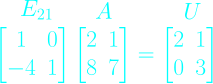
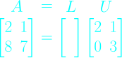

# Lec 4. Factorization into A = LU

## Linear Algebra, Gilbert Strang. MIT Lecture 2005 Spring

## Edited By Steve Ive
This article is based on Gilbert Strang's lecture script. The article will be described according to the flow of the lecture.

---

### The Things we are going to cover this lecture

#### What's the inverse of a product?

If I multiply two matrices A,B, what matrix will be Inverse of AB?

#### Big formula for elimination: A = LU

The net result of today's lectures is the big formula for elimination, and it is great way to look at Gaussian elimination. We know that we get from A to U by elimination. We know that we get from A to U by elimination.
We know the steps but now we get the right way to look at it, A equals L U.
So that's the high point for today.

---

## Inverse of a Product

Suppose A and B are invertible, then what matrix gives me the inverse of A and B?

What's the inverse of AB ? Do I multiply those seprate inverses?

#### Yes

I multiply the two matrices, A inverse and B inverse, but what order do I multiply?

#### In reverse order

So the right thing to put here is B inverse and A inverse. 

Why? once again it's this fact that I can move paranthesis around, so what's the right multiplication to do first?

#### B times B inverse

And of course, on the other side, below also makes Identity.

 

So, here's inverse.

While we're at it, let me do a transpose. Because the next lecture has got a lot to involves transposes.

### Transpose

If I transpose invertible square matrices, what's its inverse?

Let me start from A, A inverse equal the Identity. And let me transpose both sides.

If I transpose Identity, Identity again.

If I transpose A x A inverse, they come in opposite order.

Therefore,

But this equation tells me what I wanted to know, namely what is the inverse of the A transpose? This equation tells me that here it is. 

#### At the result, if you want to know the inverse of A transpose, and you know the inverse of A, then you just transpose that.

#### And to put it another way, transposing and inversing, you can do in either order for a single matrix. (Reverse order)

So these are like basic facts that we can now use. So now, I put it to use.

I put it to use to the subject of elimination.

Actually, the thing about elimination is it's the right way to understand what the matrix has got. This A equal L U is the most basic factorization of a matrix.

We're beyond the elimination and row operations, but it's the right algebra to do first. 

I have a matrix A, let's suppose it's a good matrix, I can do elimination, no row exchanges, pivots all fine, nothing zero in the pivot position. I get to the very end which is U.  So I get the A to U. And I want to know, what's the connection?

How is A related to U?

And this is going to tell me that there's a matrix L that connect them.

## Two by Two matrix

Below I created the two by two matrix A, that is not singular. And the elementary matrix on the left side named as E_21, since it is going to produce a zero in that position of A. And since it is just two by two matrix, it's going to produce U in one shot.

You might see the difference between A = LU and above. At the A = LU, I'm shooting for A on one side and the other matrices on the other side of the equations.

Now here, going to be my A equals L U.

1

What's the L? Well, you might see the L is the inverse of the E_21.

So what is the inverse of E_21?

Remeber those elimination matrices are easy to invert.

The inverse matrix for E_21 is below.

It is just has the plus sign because it adds back what this removes.

So what's the L stand for? Why the letter L?

If U stood for upper triangular, then of course L stands for

#### Lower Triangular

And actually, L has ones on the diagonal, whereas the U has the pivots on the diagonal.

Oh, sometimes we may want to seperate out the pivots, so can I just mention that sometiomes we could also write this as below.

It's just showing you how I would divide out this matrix of pivots to D, the diagonal matrix, and the divide the marix D's first row by two pull out the two, and second row by three to pull the three. And it's a little more balanced, because we have ones on the diagonal at U, and the diagonal matrix in the middle.

I'll basically stay with LU.

Now I have to think about bigger than two by two. At the two by two, the only difference is the minus sign and plus sign of the E_21 and L.

But, with three by three, there's a more significant difference.

Let me move up to three by three.

## Three by Three

Before we think about the three by three matrix A, what's the first elimination step?

The E_21. Because, the first step will be to get a zero in that two one position.

And then the next step will be to get a zero in the three one position.

And the final step will be to get a zero in the three two position.

That's what elimination is, and it produced U.

And let's assume that there are no row exchanges, since when I don't have to row exchange, all I do is these elimination steps. 

Now, suppose I want above stuff over on the right hand side, that's like my point here. I can multiply these together as E, but I want it over on the right. I want its inverse over there.

We know how to invert, we should take the seperate inverses, but they go in the opposite order. So it become like below.

L is product of inverses. Now you still can ask why is this guy preferring inverses?
And let me explain why. Let me explain why is A = LU nicer than EA = U?

Let me take a typical case here. I have to do three by three for you to see the improvement. The two by two above, it was just one E, no problem.

But let me go up this case.

Let's assume that the E_31 is Identity. That's a typical case in which we didn't need an E31. Maybe we already had a zero in that three one position.

Let me just do the mulitplication. On the above the diagonal, there are all zeros. And I'm going to get ones on the diagonal. Because what it is saying that I'm subtracting rows from lower rows. So nothing is moving upwards as it did last time in Gauss Jordan.

As above, how that ten is get in there? The ten got in there because I subtracted two of row one from row two, and then I subtracted five of that new row two from row three. So doing it in that order, how did row one effect row three?

Well, it did, because two of it got removed from row two and then five of those got removed from row three. So altogether ten, of row one got thrown into row three. Now my point is in the reverse direction, so let me write down the inverses.

### Inverses(reverse order)

So now this is going to E that goes on the left of A.

Now I'm going to do the inverses in the opposite order, so the opposite order means I put E_21 inverse first.

So what's the inverse of E_21?

Same thing with a plus sign, right?

For the individual matrices, instead of taking away two, I add back two of row one to row two, so no problem.

And in reverse order, I want to inverse E_32, so now the inverse is again the same thing, but add in the five.

And now I'll do that multiplication and I'll get a happy result.

Let me do the multiplication. So row one of the answer is one zero zero.
Then I have two one zero on the second row.
And what's the third row? 0 5 1 Because one way to say is this is saying take one of the last row and there it is. And it is the one that goes on the left of U. 

Let me make the point now in words. The order that the matrices come for L is the right order. The two and the five don't sort of interfere to produce this ten. In the right order, the multipliers just sit in the matrix L.

That's the point -- that if I want to know L, I have no work to do. I just keep a record of what those multiplier are. And that gives me L. 

So, let me say it clear.

### A = LU

***If now row exchanges, multipliers go directly into L.***

So if no row exchanges, the multipliers that those numbers that we multiplied rows by and subtracted, when we did an elimination step -- the multipliers go directly into L.

So L is -- this is the way, to look at elimination. You go through the elimination steps, and actually if you do it right, you can throw away A as you create L U.

If you think about it, those steps of eliminations as when you've finished with row two of A, you've created a new row two of U, which you have to save,

and you've created the multipliers that you used which you have to svae, and then you can forget A.

So because it's all there in **L and U**.

This moment is maybe the new insight in elimination that comes from matrix doing it matrix form.

**In conclusion, we can't see what that product of Es is.**

**The matrix E is not a particularay attractive one.**

**What's great is when we put them on the other side, their inverses in the opposite order, there the L comes out just right.**

3장 확인하기

---

Can we think together how expensive is elimination?

How many operations do we do? So this is now a kind of new topic which I didn't list as on the program, but here it comes.
## How many operations on an n by n matrix A

I mean, it's a very practical quesition. Can we solve systems of order a thousand, in a second or a minute or a week?

